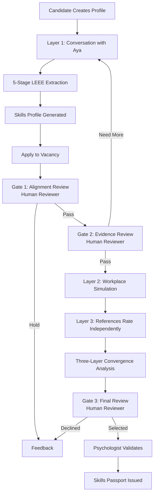
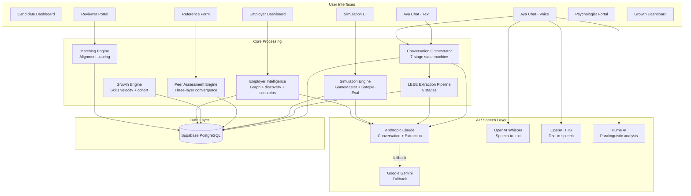

# PWD Skills Intelligence System — Current State Overview

**Platform Name:** Kaya (Filipino for "capable")
**Organization:** Virtualahan Inc., Philippines
**Document Version:** 1.0 | April 14, 2026
**Classification:** Internal / Partner

---

## 1. Executive Summary

Kaya is an AI-powered hiring intelligence platform that extracts, measures, validates, and credentials human-centric skills for persons with disabilities and excluded talent in the Philippine labor market.

The platform replaces biased traditional hiring signals — appearance, speech fluency, confidence performance, formal credentials — with a three-layer evidence system that captures what a person can actually do. A candidate's skills are assessed through AI-guided conversation, workplace simulation, and independent peer validation, then synthesized into a structured skills profile endorsed by a licensed psychologist.

Kaya serves four groups: PWD job seekers who need fair access to employment, employers who want to hire based on capability rather than appearance, Virtualahan (the social enterprise that trains PWDs and needs to prove program impact), and funders and government partners who need evidence of systemic change.

What makes Kaya different from existing hiring assessment tools is the combination of three independent evidence layers with anti-gaming measures at every layer, cultural grounding in Filipino workplace norms, voice-based paralinguistic analysis that detects emotional authenticity, employer-specific scenario generation from actual workplace context, and psychologist validation that gives the output professional credibility. No existing platform combines all of these.

The system is built on the Philippine Skills Framework (PSF) 16 Enabling Skills and Competencies, aligned with the Philippine Qualifications Framework (PQF) and the World Economic Forum's New Economy Skills taxonomy.

---

## 2. The Problem Being Solved

### Why traditional hiring disadvantages PWD candidates

Standard hiring processes rely on signals that systematically exclude people with disabilities. A structured interview rewards confident verbal articulation — disadvantaging candidates with speech impediments, hearing impairments, or social anxiety related to their disability. Resume screening favors formal education and continuous employment history — penalizing people whose disability delayed their education or created employment gaps. Video interviews reward appearance and body language — filtering out candidates whose disability affects their physical presentation.

These signals are proxies for capability, not measures of it. A deaf person can be an exceptional problem-solver. A person with cerebral palsy can be a brilliant collaborator. A wheelchair user can lead teams. Traditional hiring cannot see this.

### Why credentials alone are insufficient

In the Philippine context, many PWDs lack formal credentials not because they lack ability but because the education system was inaccessible to them. A person who managed a family business for 10 years, resolved customer complaints daily, and trained younger siblings to do the same work has demonstrated Communication, Problem-Solving, and Collaboration at an intermediate or advanced level — but holds no certificate proving it.

The Philippine government recognizes this through RA 12313 (the Lifelong Learning, Development, and Financing Act) which supports recognition of prior learning. Kaya operationalizes this principle: it captures skill evidence from lived experience, not just formal training.

### Why human-centric skills matter

Employers consistently report that the skills they struggle to find are not technical — they are human-centric: communication, collaboration, problem-solving, adaptability, emotional intelligence. The World Economic Forum's Future of Jobs Report identifies these as the skills most resistant to automation and most critical for workforce success. The Philippine Skills Framework codifies 16 Enabling Skills and Competencies that cut across all industries and occupations.

For PWD job seekers specifically, human-centric skills are often their strongest asset. A person who has navigated a world not designed for them has developed resilience, adaptability, and problem-solving capabilities that many able-bodied candidates have never been tested on.

### Why a structured skills passport matters

An unstructured reference check or a self-reported claim is not sufficient evidence for an employer to change their hiring behavior. What employers need is a structured, evidence-based profile that shows: this person demonstrated this skill, at this proficiency level, supported by this evidence, validated by this methodology, endorsed by this professional. That is what Kaya's skills passport provides.

---

## 3. Who Uses the Platform

### Job Seekers (primarily PWDs)

Job seekers create a profile, have a conversation with Aya (the AI assistant) via text or voice, participate in a workplace simulation, and provide references who independently rate them. They receive a skills profile showing their human-centric capabilities with evidence. They can use this profile to apply for jobs where their skills — not their disability — are evaluated.

Accessibility considerations: voice mode for people who cannot type easily, text mode for deaf or hard-of-hearing users, Taglish (mixed English-Filipino) language support, simple conversational language, and consent-based audio processing where recordings are transcribed and immediately discarded.

### Employers and Recruiters

Employers post job descriptions, which the system analyzes to identify human-centric skill requirements. They can upload additional workplace context (handbook excerpts, team descriptions) and the system generates workplace simulation scenarios specific to their organization. They review candidates through a structured three-gate process where AI provides recommendations and evidence, but humans make every decision.

### Psychologists and Validators

Licensed PRC (Professional Regulation Commission) psychologists review the complete assessment trail across all three layers. They see the evidence, the methodology, the convergence analysis, and any gaming flags. They provide professional endorsement — or request revision — before the skills profile becomes a validated credential. This human validation step is essential for institutional trust.

### Virtualahan (Platform Operator)

Virtualahan uses the training impact measurement features to demonstrate that their programs produce measurable skill improvement. Before a training program, candidates do a baseline assessment. After the program, they do another. The system automatically calculates skill deltas and produces cohort reports showing aggregate improvement — the evidence that funders and government partners require.

---

## 4. How the Platform Works Today

### A. Layer 1 — Conversation-Based Skills Extraction

The candidate has a conversation with Aya, an AI assistant, via text or voice. This is not a structured interview — it is a storytelling conversation inspired by The Moth storytelling methodology. Aya draws out specific stories from the candidate's life: situations they faced, actions they took, what happened, how they felt, and what they learned.

The conversation follows a 7-stage structure (opening, story selection, elicitation, core probing, skill probing, verification, closing) managed by an automated state machine. A bank of 305 questions in English, Filipino, and Taglish provides the conversational intelligence. The system adapts its probe depth and pacing based on the candidate's profile.

During the conversation, interactive scenario cards appear — short dilemmas grounded in Filipino workplace culture that test specific skill gaps identified in real-time. The candidate's choices become additional behavioral evidence.

After the conversation, a 5-stage extraction pipeline processes the transcript:

1. **Segmentation** — identifies discrete stories (episodes) from the conversation
2. **Evidence extraction** — extracts structured evidence in STAR+E+R format (Situation, Task, Action, Result, Emotion, Reflection)
3. **Skill mapping** — maps evidence to Philippine Skills Framework skills, weighted by the specific job requirements
4. **Consistency validation** — cross-references across stories, checks for contradictions, and detects potential gaming
5. **Proficiency scoring** — assigns proficiency levels (Basic, Intermediate, Advanced) with confidence scores

If the conversation was conducted via voice, paralinguistic data from Hume AI Expression Measurement (48 emotion dimensions detected from voice tone, rhythm, and timbre) provides additional confidence adjustments. Genuine emotional activation when describing helping others boosts empathy confidence. Calm tone during stressful story recall boosts self-management confidence. Flat affect when claiming stressful experiences flags potential inauthenticity.

**Anti-gaming measures in Layer 1:** Aya uses oblique questioning (never asks "are you good at X"), probes for specificity (vague claims get follow-up questions), and cross-verifies across stories. The extraction pipeline's Stage 4 specifically checks for contradictions and rehearsed-sounding responses.

### B. Layer 2 — Workplace Simulation

After the conversation-based assessment, candidates who pass Gate 2 review enter a workplace simulation. This is a multi-agent scenario where the candidate interacts with AI characters who have distinct personalities, agendas, and constraints.

For example: it is Friday afternoon at a branch counter. A customer discovers they were charged twice for a remittance. A new colleague is watching nervously. The supervisor is on a phone call. The candidate must navigate this situation — communicating with the upset customer, supporting the colleague, and deciding whether to interrupt the supervisor.

Three pre-authored scenarios are available (customer escalation, team coordination, onboarding), and employers can generate scenarios specific to their own workplace by uploading seed material (job descriptions, handbook excerpts, company context). The system extracts a knowledge graph of the employer's workplace, runs a discovery simulation to find which situations most differentiate skilled from unskilled performers, and generates full scenario configurations.

Each simulation runs 5-6 rounds with 3 evaluation checkpoints and 2 twists that escalate complexity. Performance is scored across 7 dimensions using the Sotopia-Eval framework. The system then compares: does what the candidate demonstrated in the simulation match what they claimed about themselves in the conversation? This convergence analysis is a key anti-gaming mechanism — it is much harder to fake behavior under pressure with AI characters than to rehearse answers to interview questions.

In voice mode, characters speak with distinct voices and the candidate responds by speaking. The paralinguistic analysis runs on simulation responses as well, providing additional behavioral evidence.

### C. Layer 3 — Peer and Reference Validation

The candidate provides 3-5 reference contacts: former colleagues, trainers, community leaders, family members who have seen them in action. Each reference receives a unique link to a simple, mobile-friendly assessment form.

The form contains 8 questions aligned to the same PSF skills measured in Layers 1 and 2, each on a 1-5 scale with optional written examples. The rubric adapts to prioritize skills where Layer 1 and Layer 2 results diverge or confidence is low — focusing reference validation on the areas that need it most.

The system compares all three layers per skill:
- **All three agree** — highest confidence in the skill assessment
- **Candidate undersells** (Layers 2 and 3 rate higher than Layer 1) — common with modest or culturally deferential candidates; confidence is boosted
- **Candidate overclaims** (Layer 1 rates higher than Layers 2 and 3) — flagged for psychologist review; confidence is reduced

Independence verification checks whether references appear to have coordinated their responses (identical ratings, suspiciously fast submission timing, copy-pasted examples, uniformly high scores).

### D. Skills Passport

The output of all three layers is synthesized into a structured skills profile. For each skill assessed, the profile includes: proficiency level, confidence score, evidence from each layer, convergence type, and any flags. A narrative summary provides a human-readable overview.

The psychologist reviews the complete audit trail — the conversation evidence, the simulation performance, the peer ratings, the convergence analysis, the anti-gaming flags, and the methodology documentation. They enter their PRC license number and either endorse the profile, reject it, or request specific revisions.

The validated profile is designed to be portable: a candidate assessed once can use their skills passport for multiple job applications.

### E. Employer Side

Employers enter job descriptions, which the system analyzes to generate a competency blueprint — a structured map of which human-centric skills the role requires, weighted by importance. This translation is significant: most job descriptions describe technical requirements but not the human skills that actually determine success.

Candidates are matched against the competency blueprint using evidence from all three assessment layers. The matching produces an alignment score plus a per-skill fit map showing where the candidate meets, exceeds, or falls short of requirements.

The employer reviews candidates through three gates:
- **Gate 1 (Alignment):** Does this person's profile align with what the role needs?
- **Gate 2 (Evidence):** Is there sufficient behavioral evidence supporting their capabilities?
- **Gate 3 (Predictability):** Given simulation performance, peer validation, and convergence data, can we predict this person will succeed?

At every gate, the system provides an AI recommendation and the supporting evidence. A human reviewer makes the final decision. The system explicitly positions itself as decision-support, not decision-making.

---

## 5. End-to-End Process Flow

### Narrative

A PWD job seeker creates their profile, indicating their disability type, languages, work experience, and accessibility needs. They have a conversation with Aya — either typing on their phone or speaking aloud. Aya draws out stories from their life, probing for specific situations and actions. During the conversation, a couple of interactive scenario cards appear, testing skills that haven't emerged naturally.

After the conversation ends, the extraction pipeline runs automatically, producing a skills profile mapped to the Philippine Skills Framework. The candidate can see their profile and apply to vacancies.

An employer has posted a vacancy. The system has analyzed the job description and identified that this role needs strong Communication, Problem-Solving, and Collaboration. The candidate's application triggers Gate 1, where a recruiter reviews the alignment and passes.

At Gate 2, a hiring manager reviews the extraction evidence — the specific stories, the behavioral indicators, the confidence scores — and decides the evidence is sufficient.

The candidate receives an invitation to enter a workplace simulation. They face three AI characters in a realistic scenario specific to the employer's context. Over 5-6 rounds, they demonstrate how they actually handle pressure, conflict, and coordination.

In parallel, the candidate's references receive links to a short assessment form. Three out of five respond independently.

At Gate 3, the final reviewer sees everything: the conversation evidence (Layer 1), the simulation performance (Layer 2), the peer ratings (Layer 3), and how these converge. All three layers agree that this candidate has Intermediate Communication and Advanced Problem-Solving. The reviewer approves.

A psychologist reviews the full audit trail, confirms the methodology is sound, and endorses the skills passport. The candidate is selected for the role — hired for what they can do, not filtered out for how they appear.

### Process Flow Diagram

### User Journey Summary

| Actor | Entry Point | Key Steps | Output |
|---|---|---|---|
| Job Seeker | Profile creation | Conversation → Extraction → Apply → Simulation → References | Skills profile, job applications |
| Employer | Organization setup | Post vacancy → Review Gates 1-3 → Decide | Hiring decision with evidence |
| Psychologist | Validation dashboard | Review L1+L2+L3 → Methodology check → Endorse | Validated skills passport |
| Virtualahan | Growth dashboard | Baseline → Training → Post-assessment → Cohort report | Impact evidence for funders |

---

## 6. High-Level Architecture

---

## 7. Technology Stack

| Layer | Technology | Purpose |
|---|---|---|
| Frontend | Next.js 14, TypeScript, Tailwind CSS | Web application, 19 pages |
| Backend | Next.js API Routes (serverless) | 22 API endpoints |
| Database | Supabase (PostgreSQL) | All data persistence, authentication |
| Primary AI | Anthropic Claude (Opus 4.5 / Sonnet) | Conversation, extraction, simulation, scenarios |
| Fallback AI | Google Gemini 2.5 Flash | Graceful degradation when Claude unavailable |
| Speech-to-Text | OpenAI Whisper | Voice transcription including Taglish |
| Text-to-Speech | OpenAI TTS (nova voice) | Aya's voice, simulation character voices |
| Emotion Analysis | Hume AI Expression Measurement | 48-dimension paralinguistic analysis from voice |
| Hosting | Vercel | Auto-deployment from GitHub |
| Authentication | Supabase Auth | User management and session security |

---

## 8. Current Product Maturity

### Working and stable
- Layer 1 conversation with Aya (text and voice) — the core interaction has been tested and demonstrated
- 5-stage LEEE extraction pipeline — produces structured skills profiles from transcripts
- Three-gate employer review pipeline — functional with demo data
- Multi-agent simulation engine with 3 pre-authored scenarios
- Employer scenario generation from seed material
- Psychologist review interface with research anchoring
- Training impact measurement with cohort analytics
- Voice system with Hume AI paralinguistic analysis

### Emerging and functional but not production-tested
- Peer/360 reference assessment — engine built, untested with real references
- Employer scenario generation — built, untested with real employer data
- Three-layer convergence — calculation logic built, untested end-to-end with real data across all layers
- Growth tracking and funder reports — built, no real cohort data yet

### Prototype-level or incomplete
- Skills Passport export — no machine-readable credential format yet
- Email/SMS notifications — not implemented (references currently invited via manual link sharing)
- Automated testing — test scripts exist but no CI/CD pipeline
- Error monitoring — no production observability

### Current limitations
- The platform has been demonstrated at a conference but has not yet been used with real employers, real psychologists, or real PWD candidates at scale
- Database schema changes require manual application (no migration tooling)
- Long conversation extractions (5 sequential AI calls) may approach serverless function timeout limits
- The skills taxonomy implements 8 skills in full detail while the extraction prompts reference all 16 PSF skills
- No formal accessibility audit against WCAG standards has been conducted

---

## 9. Strengths of the Current Design

**Evidence-based assessment, not self-reported claims.** Every skill score is grounded in behavioral evidence extracted from specific stories — not a multiple-choice test or a self-assessment questionnaire. This produces qualitatively different data than traditional tools.

**Three-layer triangulation with anti-gaming.** A candidate can rehearse answers (Layer 1) and may perform well in a controlled simulation (Layer 2), but they cannot fabricate what multiple independent references say about them (Layer 3). This layered approach with cross-layer convergence analysis creates a robust assessment that is difficult to game.

**Cultural grounding.** The system is designed for Filipino workplace culture from the ground up — not adapted from a Western assessment framework. Sikolohiyang Pilipino concepts, Taglish language support, and indirect communication style recognition are embedded in the prompts and scoring logic. This is essential for fair assessment of Filipino PWDs.

**Multimodal accessibility.** Voice mode enables people who cannot type easily. Text mode serves deaf or hard-of-hearing users. The conversational format (not test format) reduces anxiety. Taglish support means candidates can express themselves naturally.

**Employer demand translation.** Most job descriptions describe technical requirements but not the human skills that determine success. The system's competency blueprint extraction and employer scenario generation translate "what the employer wrote" into "what the employer actually needs."

**Human-in-the-loop design.** The system explicitly positions AI as decision-support, not decision-making. Every hiring gate requires a human reviewer. The psychologist validation adds a layer of professional accountability. This design is both ethically sound and practically important for institutional trust.

**Paralinguistic intelligence.** Analyzing not just what someone says but how they say it — emotional activation, thoughtful pauses, genuine laughter, voice tremor during difficult memories — provides skill signals that no text-based system can capture. This is particularly valuable for PWD candidates whose verbal articulation may not reflect their actual emotional intelligence.

---

## 10. Key Risks and Open Questions

**Fairness validation.** While the system includes bias mitigation measures (anti-credential scoring, communication style bias audit, cultural calibration), no formal disparate impact analysis has been conducted. Before deployment at scale, the system should be tested for whether candidates with certain disability types, communication styles, or language preferences score systematically differently.

**Scaling.** The 5-stage extraction pipeline makes 5 sequential AI API calls per session. At scale, this creates latency and cost concerns. Background processing and caching strategies will be needed.

**Reference quality.** Layer 3 depends on references providing honest, independent assessments. In Filipino culture, strong social bonds may lead references to be overly positive. The independence verification helps but may not fully address this.

**Psychologist availability.** The validation workflow requires licensed PRC psychologists. At scale, psychologist capacity could become a bottleneck. The workflow may need to evolve to allow psychologists to validate at cohort level rather than individual level.

**Employer adoption.** The platform requires employers to change their hiring process — adding three gates and an evidence review step. This is more effort than traditional screening. The value proposition must be clear and the process must be streamlined for employer adoption.

**Privacy and compliance.** Voice data is processed but not stored. Text transcripts persist in the database. A formal data retention policy and Philippine Data Privacy Act compliance documentation are needed before real deployment.

**Explainability under pressure.** If an employer asks "why was this candidate scored Intermediate on Communication?", the system can show evidence. But if a candidate challenges a low score, the explainability of AI-driven extraction may be scrutinized. The psychologist endorsement provides institutional backing, but the underlying AI logic should also be defensible.

**Prompt stability.** The quality of extraction depends heavily on prompt engineering. Prompt changes could alter scoring patterns. A prompt versioning and regression testing framework would strengthen confidence in consistency over time.

---

## 11. Roadmap Themes

### Immediate (weeks)
- First real employer pilot — test scenario generation and three-gate pipeline with actual company data and real reviewers
- First psychologist validation — test the complete assessment trail review with a licensed PRC professional
- Email/SMS notification system — enable reference invitation workflows without manual link sharing
- Skills Passport v1 — define the machine-readable credential format for downstream systems

### Medium-term (months)
- Production hardening — database migrations, error monitoring, rate limiting, automated testing, CI/CD
- Market intelligence layer — labor market simulation using public data from TESDA, PSA, and industry sources to forecast skills demand (architecture decision pending)
- Employer workforce analytics — aggregate anonymized skills data across candidates to provide employers with workforce-level insights
- Formal accessibility audit — WCAG compliance testing, screen reader compatibility, cognitive load assessment

### Long-term (2027 and beyond)
- ASEAN skills portability — cross-border recognition of skills profiles mapped to each country's national skills framework
- Government API integration — TESDA, DOLE, CHED credential verification via API
- Skills demand forecasting — predict which skills will be in demand 6-12 months from now to inform Virtualahan's training curriculum

---

## 12. Closing Summary

Kaya represents a fundamentally different approach to hiring assessment — one that starts from the premise that people with disabilities have capabilities that traditional hiring cannot see, and builds the evidence infrastructure to make those capabilities visible, measurable, and trustworthy.

The platform is not a simple test or a screening tool. It is a structured evidence system that combines AI conversation, behavioral simulation, and independent peer validation to produce a skills profile that employers can rely on and psychologists can endorse. The cultural grounding, anti-gaming design, and human-in-the-loop architecture reflect careful thought about what it takes to change hiring behavior in a real labor market.

The system is functional and has been demonstrated. The immediate priority is moving from demonstration to deployment — testing with real employers, real candidates, and real psychologists. The infrastructure for this is built. What remains is the operational, institutional, and trust-building work that turns a working platform into a working hiring ecosystem.

---

## Glossary

| Term | Definition |
|---|---|
| **Kaya** | Platform name. Filipino for "capable." Previously called SIS (Skills Intelligence System). |
| **PSF** | Philippine Skills Framework — national taxonomy of Enabling Skills and Competencies. |
| **PQF** | Philippine Qualifications Framework — levels structure for credentials. |
| **LEEE** | Lived Experience Extraction Engine — the 5-stage AI pipeline that transforms conversation into structured skill evidence. |
| **STAR+E+R** | Situation, Task, Action, Result + Emotion + Reflection — the evidence structure extracted from each story. |
| **Moth Storytelling** | Conversation methodology inspired by The Moth (storytelling organization). Draws out specific lived experiences rather than hypothetical answers. |
| **Sotopia-Eval** | 7-dimension evaluation framework for social simulations, used to score Layer 2 performance. |
| **GameMaster** | Orchestrator that runs Layer 2 multi-agent simulations with characters, rounds, checkpoints, and twists. |
| **Three-layer convergence** | Comparison of Layer 1 (self-report), Layer 2 (simulation), and Layer 3 (peer) scores per skill, with weighted scoring: L2 (40%) + L3 (35%) + L1 (25%). |
| **Skills Velocity** | Rate of skill improvement per week, used to measure training program impact. |
| **Gate** | A human review checkpoint in the employer pipeline. Three gates: Alignment (1), Evidence (2), Predictability (3). |
| **Aya** | The AI conversational assistant that conducts Layer 1 conversations. |
| **Hume AI** | Expression Measurement service that analyzes 48 emotion dimensions from voice tone, rhythm, and timbre. |
| **SP / Sikolohiyang Pilipino** | Filipino Psychology — cultural framework including concepts like kapwa (shared identity), pakikiramdam (sensing others' feelings), hiya (social propriety), bayanihan (communal unity). |
| **PRC** | Professional Regulation Commission — Philippine licensing body for psychologists. |
| **PWD** | Person/People with Disability. |

---

*This document describes the platform as it exists in the codebase as of April 14, 2026. Future-state features are identified as roadmap items, not current capabilities. Where evidence is partial or inferred from code patterns rather than confirmed through testing, this is noted.*
