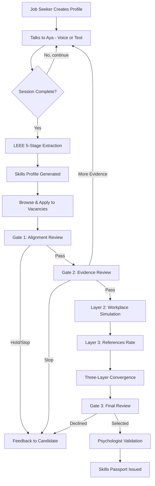
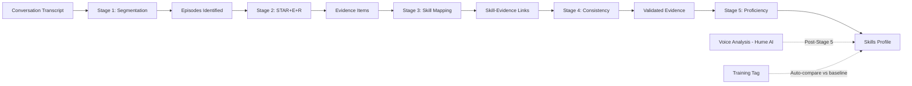
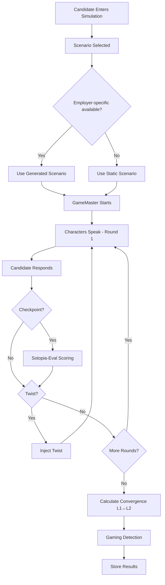
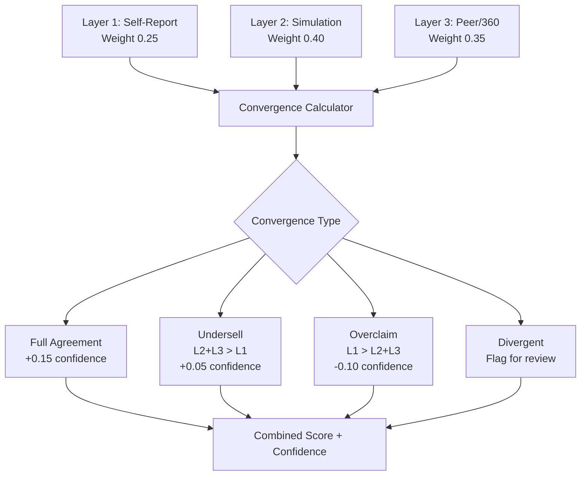
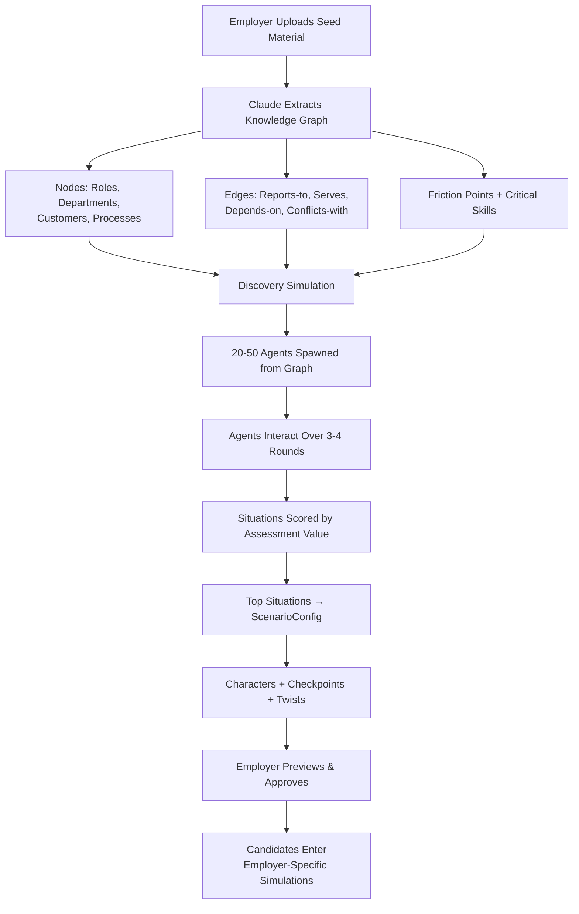
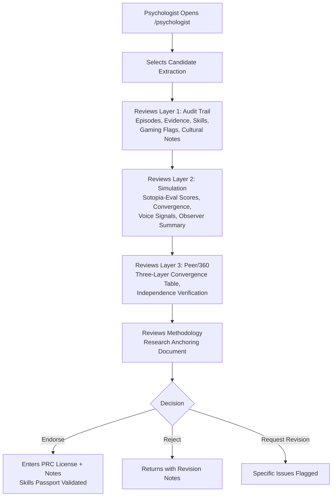
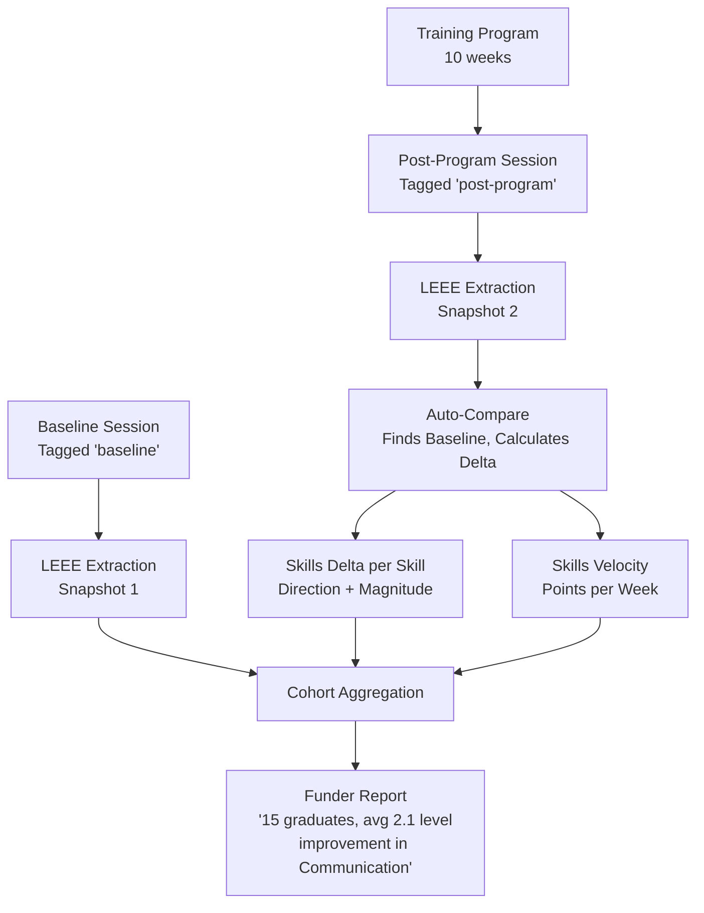

# Kaya — Process Flows

## 1. Candidate Assessment Journey

**Plain English:** The candidate creates a profile, then has a conversation with Aya (text or voice). The AI extracts skills from their stories using a 5-stage pipeline. They apply to a job. A human reviewer checks alignment (Gate 1), then evidence quality (Gate 2). If passed, they enter a workplace simulation where AI characters test their behavior. References independently rate them. All three layers are compared (convergence). A final reviewer decides (Gate 3). If selected, a psychologist validates the full audit trail and issues a skills passport.

## 2. LEEE Extraction Pipeline

**Plain English:** The transcript goes through 5 AI stages. Stage 1 identifies discrete stories (episodes). Stage 2 extracts structured evidence using STAR+E+R format. Stage 3 maps evidence to PSF skills weighted by the vacancy requirements. Stage 4 cross-references for consistency and catches gaming. Stage 5 assigns proficiency levels with confidence scores. If voice data exists, paralinguistic adjustments are applied. If the session is tagged post-training, it auto-compares against the baseline.

## 3. Layer 2 Simulation Flow

**Plain English:** The candidate enters a workplace simulation with 3 AI characters who have distinct personalities and agendas. The system uses employer-generated scenarios if available, otherwise static ones. Over 5-6 rounds, characters respond to the candidate, checkpoints evaluate performance on 7 dimensions, and twists escalate complexity. After completion, the system compares simulation behavior (L2) against conversation claims (L1) to check convergence.

## 4. Three-Layer Convergence

**Plain English:** Each skill is scored independently by three layers. The combined score weights behavioral observation (L2) highest at 40%, peer validation (L3) at 35%, and self-report (L1) at 25%. When all three agree, confidence is highest. When the candidate undersells (peers and simulation rate them higher than they rate themselves), confidence is boosted. When they overclaim (they say they're better than simulation and peers suggest), confidence is reduced and it's flagged for the psychologist.

## 5. Employer Scenario Generation

**Plain English:** The employer pastes their workplace context (job descriptions, handbook, company description). Claude extracts a knowledge graph of their workplace — who works there, how they relate, what goes wrong. A discovery simulation spawns agents from this graph and lets them interact to find which situations most differentiate skilled from unskilled performers. The top situations are converted into full simulation scenarios with characters, checkpoints, and twists. The employer previews and approves. Candidates then enter simulations tailored to that specific workplace.

## 6. Psychologist Validation Flow

**Plain English:** The psychologist reviews the complete evidence trail across all three layers. They see the extraction (what was said), the simulation (what was done), the peer ratings (what others confirm), and the methodology (why this approach is valid). They then make a professional judgment: endorse the skills passport (entering their PRC license number), reject it, or request specific revisions. This human validation is what gives the skills passport professional credibility.

## 7. Training Impact Measurement

**Plain English:** Before training, the candidate does a baseline conversation with Aya. After the program, they do another one tagged as "post-program." The system automatically finds the baseline and calculates how each skill changed. Skills Velocity measures the improvement rate per week. Multiple candidates are aggregated into cohort reports showing which programs produce the most improvement — the metric that proves to funders and government that training works.
